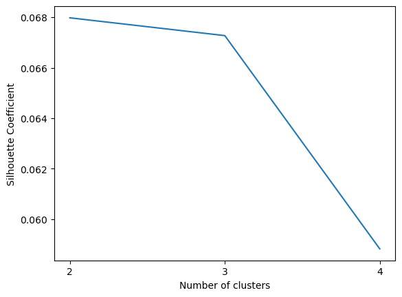

# Ai Project Phase-3

In this phase, we've applied an unsupervised learning algorithm (K-means clustering) to our
dataset using at least three different sizes of K. We justified our choice for the sizes of K, then we compared and discussed the results on our dataset using different evaluation methods and metrics (Silhouette coefficient, total within-cluster sum of square, BCubed precision and recall).

This Jupiter notebook include the following:

o Our code with suitable comments.
o The results of applying different sizes of K with interpreting our results.

# Unsupervised Learning: (Clustering)

Clustering is the process of grouping similar data points together. First, we prepared the data for clustering. After that, we used the k-mean approach which further selects k ojects at random and sets them as cluster centers and allocates the objects to the closest cluster center.To improve the cluster we iteratively updated the cluster center and reassigned the items to the new center. We have used the k-means() to divide our dataset to groups.


```python
# Import the necessary libraries

import numpy as np
import pandas as pd
import seaborn as sns
from sklearn.cluster import KMeans
from sklearn.metrics import silhouette_score
import matplotlib.pyplot as plt
from collections.abc import Iterable
from sklearn.decomposition import PCA

```


```python
# Load the dataset
df = pd.read_csv(r'train.csv')

```


```python
# delete the outcome variable
X=df.drop('price_range', axis=1)
y=df['price_range']
X.shape
```


    (2000, 20)


```python
# data preprossing
from sklearn.preprocessing import StandardScaler

scaler=StandardScaler()
# fit the dataset
mdata_scaled = scaler.fit_transform(X)
# display the shape of the data
mdata_scaled.shape

```


    (2000, 20)


# Building and training the clustering model.

To start of our clustering model we will be setting the number of clusters as 5 as a trial and after that we will be doing measurment to decide on the number of k we should use and perform the k-means clustering model on 3 different sizes of k based on the results of this k-mean model size. 


```python
# building the model with k = 5
kmeans=KMeans(n_clusters=5, max_iter=300)
kmeans.fit(mdata_scaled)
```

    /Users/razan/anaconda3/lib/python3.10/site-packages/sklearn/cluster/_kmeans.py:870: FutureWarning: The default value of `n_init` will change from 10 to 'auto' in 1.4. Set the value of `n_init` explicitly to suppress the warning
      warnings.warn(


<style>#sk-container-id-1 {color: black;background-color: white;}#sk-container-id-1 pre{padding: 0;}#sk-container-id-1 div.sk-toggleable {background-color: white;}#sk-container-id-1 label.sk-toggleable__label {cursor: pointer;display: block;width: 100%;margin-bottom: 0;padding: 0.3em;box-sizing: border-box;text-align: center;}#sk-container-id-1 label.sk-toggleable__label-arrow:before {content: "▸";float: left;margin-right: 0.25em;color: #696969;}#sk-container-id-1 label.sk-toggleable__label-arrow:hover:before {color: black;}#sk-container-id-1 div.sk-estimator:hover label.sk-toggleable__label-arrow:before {color: black;}#sk-container-id-1 div.sk-toggleable__content {max-height: 0;max-width: 0;overflow: hidden;text-align: left;background-color: #f0f8ff;}#sk-container-id-1 div.sk-toggleable__content pre {margin: 0.2em;color: black;border-radius: 0.25em;background-color: #f0f8ff;}#sk-container-id-1 input.sk-toggleable__control:checked~div.sk-toggleable__content {max-height: 200px;max-width: 100%;overflow: auto;}#sk-container-id-1 input.sk-toggleable__control:checked~label.sk-toggleable__label-arrow:before {content: "▾";}#sk-container-id-1 div.sk-estimator input.sk-toggleable__control:checked~label.sk-toggleable__label {background-color: #d4ebff;}#sk-container-id-1 div.sk-label input.sk-toggleable__control:checked~label.sk-toggleable__label {background-color: #d4ebff;}#sk-container-id-1 input.sk-hidden--visually {border: 0;clip: rect(1px 1px 1px 1px);clip: rect(1px, 1px, 1px, 1px);height: 1px;margin: -1px;overflow: hidden;padding: 0;position: absolute;width: 1px;}#sk-container-id-1 div.sk-estimator {font-family: monospace;background-color: #f0f8ff;border: 1px dotted black;border-radius: 0.25em;box-sizing: border-box;margin-bottom: 0.5em;}#sk-container-id-1 div.sk-estimator:hover {background-color: #d4ebff;}#sk-container-id-1 div.sk-parallel-item::after {content: "";width: 100%;border-bottom: 1px solid gray;flex-grow: 1;}#sk-container-id-1 div.sk-label:hover label.sk-toggleable__label {background-color: #d4ebff;}#sk-container-id-1 div.sk-serial::before {content: "";position: absolute;border-left: 1px solid gray;box-sizing: border-box;top: 0;bottom: 0;left: 50%;z-index: 0;}#sk-container-id-1 div.sk-serial {display: flex;flex-direction: column;align-items: center;background-color: white;padding-right: 0.2em;padding-left: 0.2em;position: relative;}#sk-container-id-1 div.sk-item {position: relative;z-index: 1;}#sk-container-id-1 div.sk-parallel {display: flex;align-items: stretch;justify-content: center;background-color: white;position: relative;}#sk-container-id-1 div.sk-item::before, #sk-container-id-1 div.sk-parallel-item::before {content: "";position: absolute;border-left: 1px solid gray;box-sizing: border-box;top: 0;bottom: 0;left: 50%;z-index: -1;}#sk-container-id-1 div.sk-parallel-item {display: flex;flex-direction: column;z-index: 1;position: relative;background-color: white;}#sk-container-id-1 div.sk-parallel-item:first-child::after {align-self: flex-end;width: 50%;}#sk-container-id-1 div.sk-parallel-item:last-child::after {align-self: flex-start;width: 50%;}#sk-container-id-1 div.sk-parallel-item:only-child::after {width: 0;}#sk-container-id-1 div.sk-dashed-wrapped {border: 1px dashed gray;margin: 0 0.4em 0.5em 0.4em;box-sizing: border-box;padding-bottom: 0.4em;background-color: white;}#sk-container-id-1 div.sk-label label {font-family: monospace;font-weight: bold;display: inline-block;line-height: 1.2em;}#sk-container-id-1 div.sk-label-container {text-align: center;}#sk-container-id-1 div.sk-container {/* jupyter's `normalize.less` sets `[hidden] { display: none; }` but bootstrap.min.css set `[hidden] { display: none !important; }` so we also need the `!important` here to be able to override the default hidden behavior on the sphinx rendered scikit-learn.org. See: https://github.com/scikit-learn/scikit-learn/issues/21755 */display: inline-block !important;position: relative;}#sk-container-id-1 div.sk-text-repr-fallback {display: none;}</style><div id="sk-container-id-1" class="sk-top-container"><div class="sk-text-repr-fallback"><pre>KMeans(n_clusters=5)</pre><b>In a Jupyter environment, please rerun this cell to show the HTML representation or trust the notebook. <br />On GitHub, the HTML representation is unable to render, please try loading this page with nbviewer.org.</b></div><div class="sk-container" hidden><div class="sk-item"><div class="sk-estimator sk-toggleable"><input class="sk-toggleable__control sk-hidden--visually" id="sk-estimator-id-1" type="checkbox" checked><label for="sk-estimator-id-1" class="sk-toggleable__label sk-toggleable__label-arrow">KMeans</label><div class="sk-toggleable__content"><pre>KMeans(n_clusters=5)</pre></div></div></div></div></div>


After that we will be checking the SSE (Sum of Squared Errors), which is a measure of the within-cluster sum of squared distances between each data point and the centroid of its cluster. The lower the SSE value, the better the clustering. SSE can be used to evaluate the quality of a K-means clustering solution. A low SSE value indicates that the data points are well-clustered and that the centroids are representative of the data points in their respective clusters.


```python
# measuring the SSE
kmeans.inertia_
```


    33321.715640970615


We will then be checking the Coordinates of cluster centers.


```python
# cluster values
kmeans.cluster_centers_
```


    array([[ 9.00654106e-02, -4.94925597e-02,  6.16220093e-02,
            -6.71707656e-02,  1.49381704e+00,  2.20660185e-01,
            -1.65902832e-01, -5.22448084e-02,  1.11911324e-01,
            -2.93985257e-02,  1.11228445e+00, -4.27488072e-02,
            -8.49480066e-02,  1.37836439e-01, -1.52797059e-01,
            -2.52208263e-01,  4.20667196e-02,  4.79872872e-01,
             7.04885209e-02,  3.98282660e-02],
           [-4.15728671e-02,  1.09797775e-03, -1.94956137e-01,
            -1.11008169e-01, -4.09722568e-01,  3.22283252e-01,
             8.20026479e-02,  5.97936201e-02,  4.16784997e-02,
             3.44982059e-02, -3.36175062e-01,  1.25601056e+00,
             1.02125114e+00,  2.38278892e-02,  3.05534967e-01,
             1.91805910e-01, -1.25323450e-01,  5.10900242e-01,
             8.59896784e-02,  1.90766471e-01],
           [ 7.01003503e-02, -7.82996030e-02,  2.43251427e-02,
             9.39533051e-02, -5.07025067e-01,  3.00193468e-01,
             1.73796583e-03,  6.74923829e-03,  3.02133616e-02,
            -1.02777373e-01, -3.90280483e-01, -4.59947590e-01,
            -2.52907983e-01, -1.08547227e-02, -7.27459841e-01,
            -6.49460705e-01,  8.93300416e-02,  5.59640631e-01,
            -3.68014838e-02, -1.84449288e-01],
           [-9.91049382e-02,  7.01127953e-02,  2.32983897e-02,
            -2.60702799e-03, -3.12404647e-01,  3.94523376e-01,
             6.29520637e-02, -5.53425126e-02, -1.87456773e-01,
             9.73518282e-02, -2.16513022e-01, -5.13258426e-01,
            -4.83571767e-01, -7.75434016e-02,  8.81400010e-01,
             1.00955755e+00, -1.64569975e-01,  5.53229425e-01,
            -5.51813211e-02,  4.61138090e-02],
           [-3.42439759e-02,  6.47078307e-02,  5.15844503e-02,
             3.57110416e-02, -6.12245138e-02, -1.04396559e+00,
             1.54091089e-02,  3.33926650e-02,  7.54748602e-04,
             2.88262486e-02, -2.19585383e-02,  8.01275922e-03,
            -3.06816910e-02, -5.03700800e-02, -3.79592624e-02,
            -6.30629613e-02,  9.65280772e-02, -1.78686097e+00,
            -3.44470095e-02, -1.18129739e-02]])


We will also check the number of iterations that has been run.


```python
#Showing number of runs
kmeans.n_iter_
```


    40


To make sure that all features has been seen during the fit, we will be using the below code.


```python
# Checking number of features
kmeans.n_features_in_
```


    20


Labels of each point.


```python
# Checking number of labels
cluster_labels=kmeans.labels_
cluster_labels
```


    array([4, 1, 1, ..., 2, 3, 3], dtype=int32)


We will then be measuring the Silhouette score which is a measure of how well each data point is clustered. It is calculated as the ratio between the average intra-cluster distance and the average nearest-cluster distance for each data point. The higher the silhouette score, the better the clustering. Additionally, Silhouette score can be used to evaluate the quality of a clustering solution. A high silhouette score indicates that the data points are well-clustered and that the clusters are well-separated.


```python
# Checking silhouette score
silhoutte_avg=silhouette_score(mdata_scaled,cluster_labels )
print("The silhouette score is: {0}".format(silhoutte_avg))
```

    The silhouette score is: 0.05392763641112842


We will then be finding the Optimal Silhouette score and SSE.


```python
# optimizing the clusters 
sse=[]
s_score=[]
max_k=5
for num_custer in range(2,max_k):
  model=KMeans(n_clusters=num_custer, max_iter=60)
  model.fit(mdata_scaled)
  # SSE:Store inertia value
  sse.append(model.inertia_)
  #silhouette_score
  sc=silhouette_score(mdata_scaled, model.labels_, sample_size=1000)
  s_score.append(sc)
```

    /Users/razan/anaconda3/lib/python3.10/site-packages/sklearn/cluster/_kmeans.py:870: FutureWarning: The default value of `n_init` will change from 10 to 'auto' in 1.4. Set the value of `n_init` explicitly to suppress the warning
      warnings.warn(
    /Users/razan/anaconda3/lib/python3.10/site-packages/sklearn/cluster/_kmeans.py:870: FutureWarning: The default value of `n_init` will change from 10 to 'auto' in 1.4. Set the value of `n_init` explicitly to suppress the warning
      warnings.warn(
    /Users/razan/anaconda3/lib/python3.10/site-packages/sklearn/cluster/_kmeans.py:870: FutureWarning: The default value of `n_init` will change from 10 to 'auto' in 1.4. Set the value of `n_init` explicitly to suppress the warning
      warnings.warn(


We will then be visualizing the SSE based on the number of clusters and find the optimal solution.


```python
# plotting of silhouette score
plt.plot(range(2,max_k), sse )
plt.xticks(range(2,max_k))
plt.xlabel("Number of clusters")
plt.ylabel("SSE")
plt.show()
```


    

    


The output of this above code demonstrates the optimal number of clusters is likely to be k=2 and will be confirmed after applying the model.


```python
# Displaying the silhouette scores for each cluster
s_score
```


    [0.06797585396182768, 0.06727147958600048, 0.05882994051534455]


```python
#Silhouette Coefficient plot:
#Analysing silhouette score on plot
plt.plot(range(2,max_k), s_score )
plt.xticks(range(2,max_k))
plt.xlabel("Number of clusters")
plt.ylabel("Silhouette Coefficient")
plt.show()
```


    

    


After performing the above calculation we will be using it's results to choose the sizes of k, We can see that a higher Solihouette score and SSE value are found in the 2,3,4 k-means cluster sizes. based on this observation, we will be choosing them as our clustering k-means sizes.

# K=2


```python
# building the model with k = 2
kmeans1=KMeans(n_clusters=2, max_iter=300)
kmeans1.fit(mdata_scaled)

```

    /Users/razan/anaconda3/lib/python3.10/site-packages/sklearn/cluster/_kmeans.py:870: FutureWarning: The default value of `n_init` will change from 10 to 'auto' in 1.4. Set the value of `n_init` explicitly to suppress the warning
      warnings.warn(


<style>#sk-container-id-2 {color: black;background-color: white;}#sk-container-id-2 pre{padding: 0;}#sk-container-id-2 div.sk-toggleable {background-color: white;}#sk-container-id-2 label.sk-toggleable__label {cursor: pointer;display: block;width: 100%;margin-bottom: 0;padding: 0.3em;box-sizing: border-box;text-align: center;}#sk-container-id-2 label.sk-toggleable__label-arrow:before {content: "▸";float: left;margin-right: 0.25em;color: #696969;}#sk-container-id-2 label.sk-toggleable__label-arrow:hover:before {color: black;}#sk-container-id-2 div.sk-estimator:hover label.sk-toggleable__label-arrow:before {color: black;}#sk-container-id-2 div.sk-toggleable__content {max-height: 0;max-width: 0;overflow: hidden;text-align: left;background-color: #f0f8ff;}#sk-container-id-2 div.sk-toggleable__content pre {margin: 0.2em;color: black;border-radius: 0.25em;background-color: #f0f8ff;}#sk-container-id-2 input.sk-toggleable__control:checked~div.sk-toggleable__content {max-height: 200px;max-width: 100%;overflow: auto;}#sk-container-id-2 input.sk-toggleable__control:checked~label.sk-toggleable__label-arrow:before {content: "▾";}#sk-container-id-2 div.sk-estimator input.sk-toggleable__control:checked~label.sk-toggleable__label {background-color: #d4ebff;}#sk-container-id-2 div.sk-label input.sk-toggleable__control:checked~label.sk-toggleable__label {background-color: #d4ebff;}#sk-container-id-2 input.sk-hidden--visually {border: 0;clip: rect(1px 1px 1px 1px);clip: rect(1px, 1px, 1px, 1px);height: 1px;margin: -1px;overflow: hidden;padding: 0;position: absolute;width: 1px;}#sk-container-id-2 div.sk-estimator {font-family: monospace;background-color: #f0f8ff;border: 1px dotted black;border-radius: 0.25em;box-sizing: border-box;margin-bottom: 0.5em;}#sk-container-id-2 div.sk-estimator:hover {background-color: #d4ebff;}#sk-container-id-2 div.sk-parallel-item::after {content: "";width: 100%;border-bottom: 1px solid gray;flex-grow: 1;}#sk-container-id-2 div.sk-label:hover label.sk-toggleable__label {background-color: #d4ebff;}#sk-container-id-2 div.sk-serial::before {content: "";position: absolute;border-left: 1px solid gray;box-sizing: border-box;top: 0;bottom: 0;left: 50%;z-index: 0;}#sk-container-id-2 div.sk-serial {display: flex;flex-direction: column;align-items: center;background-color: white;padding-right: 0.2em;padding-left: 0.2em;position: relative;}#sk-container-id-2 div.sk-item {position: relative;z-index: 1;}#sk-container-id-2 div.sk-parallel {display: flex;align-items: stretch;justify-content: center;background-color: white;position: relative;}#sk-container-id-2 div.sk-item::before, #sk-container-id-2 div.sk-parallel-item::before {content: "";position: absolute;border-left: 1px solid gray;box-sizing: border-box;top: 0;bottom: 0;left: 50%;z-index: -1;}#sk-container-id-2 div.sk-parallel-item {display: flex;flex-direction: column;z-index: 1;position: relative;background-color: white;}#sk-container-id-2 div.sk-parallel-item:first-child::after {align-self: flex-end;width: 50%;}#sk-container-id-2 div.sk-parallel-item:last-child::after {align-self: flex-start;width: 50%;}#sk-container-id-2 div.sk-parallel-item:only-child::after {width: 0;}#sk-container-id-2 div.sk-dashed-wrapped {border: 1px dashed gray;margin: 0 0.4em 0.5em 0.4em;box-sizing: border-box;padding-bottom: 0.4em;background-color: white;}#sk-container-id-2 div.sk-label label {font-family: monospace;font-weight: bold;display: inline-block;line-height: 1.2em;}#sk-container-id-2 div.sk-label-container {text-align: center;}#sk-container-id-2 div.sk-container {/* jupyter's `normalize.less` sets `[hidden] { display: none; }` but bootstrap.min.css set `[hidden] { display: none !important; }` so we also need the `!important` here to be able to override the default hidden behavior on the sphinx rendered scikit-learn.org. See: https://github.com/scikit-learn/scikit-learn/issues/21755 */display: inline-block !important;position: relative;}#sk-container-id-2 div.sk-text-repr-fallback {display: none;}</style><div id="sk-container-id-2" class="sk-top-container"><div class="sk-text-repr-fallback"><pre>KMeans(n_clusters=2)</pre><b>In a Jupyter environment, please rerun this cell to show the HTML representation or trust the notebook. <br />On GitHub, the HTML representation is unable to render, please try loading this page with nbviewer.org.</b></div><div class="sk-container" hidden><div class="sk-item"><div class="sk-estimator sk-toggleable"><input class="sk-toggleable__control sk-hidden--visually" id="sk-estimator-id-2" type="checkbox" checked><label for="sk-estimator-id-2" class="sk-toggleable__label sk-toggleable__label-arrow">KMeans</label><div class="sk-toggleable__content"><pre>KMeans(n_clusters=2)</pre></div></div></div></div></div>


```python
# measuring the SSE for k=2
kmeans1.inertia_
```


    37298.947007751834


```python
# measuring the cluster centers values for k =2
kmeans1.cluster_centers_
```


    array([[-0.01635326, -0.01403414,  0.0449671 , -0.00332662,  0.01728774,
            -1.04396559, -0.00907203,  0.00190346,  0.01726378,  0.03101152,
             0.00584435,  0.02008197, -0.00777568, -0.00763502, -0.02835986,
            -0.03863192,  0.04867783, -0.60993227, -0.01749457,  0.0183947 ],
           [ 0.01500486,  0.01287696, -0.04125936,  0.00305232, -0.01586229,
             0.95788598,  0.008324  , -0.00174651, -0.01584031, -0.02845448,
            -0.00536246, -0.01842612,  0.00713454,  0.00700547,  0.02602146,
             0.03544654, -0.04466413,  0.55964063,  0.01605206, -0.01687797]])


```python
# measuring the number of iteration thay has been run for k = 2
kmeans1.n_iter_

```


    10


```python
# measuring the number of features used for k = 2
kmeans1.n_features_in_
```


    20


```python
# Checking number of labels
cluster_labels1=kmeans1.labels_
cluster_labels1
```


    array([0, 1, 1, ..., 1, 1, 1], dtype=int32)


```python
# Checking silhouette score
silhoutte_avg=silhouette_score(mdata_scaled,cluster_labels1 )
print("The silhouette score is for k =2 : {0}".format(silhoutte_avg))
```

    The silhouette score is for k =2 : 0.06771623890102013


```python
#Add a new column named KMeans-2Clusters to the dataset that has the current label of the value.
df['KMeans-2Clusters'] = kmeans1.labels_

#Printing the dataset with the new column.
df
```


<div>
<style scoped>
    .dataframe tbody tr th:only-of-type {
        vertical-align: middle;
    }

    .dataframe tbody tr th {
        vertical-align: top;
    }

    .dataframe thead th {
        text-align: right;
    }
</style>
<table border="1" class="dataframe">
  <thead>
    <tr style="text-align: right;">
      <th></th>
      <th>battery_power</th>
      <th>blue</th>
      <th>clock_speed</th>
      <th>dual_sim</th>
      <th>fc</th>
      <th>four_g</th>
      <th>int_memory</th>
      <th>m_dep</th>
      <th>mobile_wt</th>
      <th>n_cores</th>
      <th>...</th>
      <th>px_width</th>
      <th>ram</th>
      <th>sc_h</th>
      <th>sc_w</th>
      <th>talk_time</th>
      <th>three_g</th>
      <th>touch_screen</th>
      <th>wifi</th>
      <th>price_range</th>
      <th>KMeans-2Clusters</th>
    </tr>
  </thead>
  <tbody>
    <tr>
      <th>0</th>
      <td>842</td>
      <td>0</td>
      <td>2.2</td>
      <td>0</td>
      <td>1</td>
      <td>0</td>
      <td>7</td>
      <td>0.6</td>
      <td>188</td>
      <td>2</td>
      <td>...</td>
      <td>756</td>
      <td>2549</td>
      <td>9</td>
      <td>7</td>
      <td>19</td>
      <td>0</td>
      <td>0</td>
      <td>1</td>
      <td>1</td>
      <td>0</td>
    </tr>
    <tr>
      <th>1</th>
      <td>1021</td>
      <td>1</td>
      <td>0.5</td>
      <td>1</td>
      <td>0</td>
      <td>1</td>
      <td>53</td>
      <td>0.7</td>
      <td>136</td>
      <td>3</td>
      <td>...</td>
      <td>1988</td>
      <td>2631</td>
      <td>17</td>
      <td>3</td>
      <td>7</td>
      <td>1</td>
      <td>1</td>
      <td>0</td>
      <td>2</td>
      <td>1</td>
    </tr>
    <tr>
      <th>2</th>
      <td>563</td>
      <td>1</td>
      <td>0.5</td>
      <td>1</td>
      <td>2</td>
      <td>1</td>
      <td>41</td>
      <td>0.9</td>
      <td>145</td>
      <td>5</td>
      <td>...</td>
      <td>1716</td>
      <td>2603</td>
      <td>11</td>
      <td>2</td>
      <td>9</td>
      <td>1</td>
      <td>1</td>
      <td>0</td>
      <td>2</td>
      <td>1</td>
    </tr>
    <tr>
      <th>3</th>
      <td>615</td>
      <td>1</td>
      <td>2.5</td>
      <td>0</td>
      <td>0</td>
      <td>0</td>
      <td>10</td>
      <td>0.8</td>
      <td>131</td>
      <td>6</td>
      <td>...</td>
      <td>1786</td>
      <td>2769</td>
      <td>16</td>
      <td>8</td>
      <td>11</td>
      <td>1</td>
      <td>0</td>
      <td>0</td>
      <td>2</td>
      <td>0</td>
    </tr>
    <tr>
      <th>4</th>
      <td>1821</td>
      <td>1</td>
      <td>1.2</td>
      <td>0</td>
      <td>13</td>
      <td>1</td>
      <td>44</td>
      <td>0.6</td>
      <td>141</td>
      <td>2</td>
      <td>...</td>
      <td>1212</td>
      <td>1411</td>
      <td>8</td>
      <td>2</td>
      <td>15</td>
      <td>1</td>
      <td>1</td>
      <td>0</td>
      <td>1</td>
      <td>1</td>
    </tr>
    <tr>
      <th>...</th>
      <td>...</td>
      <td>...</td>
      <td>...</td>
      <td>...</td>
      <td>...</td>
      <td>...</td>
      <td>...</td>
      <td>...</td>
      <td>...</td>
      <td>...</td>
      <td>...</td>
      <td>...</td>
      <td>...</td>
      <td>...</td>
      <td>...</td>
      <td>...</td>
      <td>...</td>
      <td>...</td>
      <td>...</td>
      <td>...</td>
      <td>...</td>
    </tr>
    <tr>
      <th>1995</th>
      <td>794</td>
      <td>1</td>
      <td>0.5</td>
      <td>1</td>
      <td>0</td>
      <td>1</td>
      <td>2</td>
      <td>0.8</td>
      <td>106</td>
      <td>6</td>
      <td>...</td>
      <td>1890</td>
      <td>668</td>
      <td>13</td>
      <td>4</td>
      <td>19</td>
      <td>1</td>
      <td>1</td>
      <td>0</td>
      <td>0</td>
      <td>1</td>
    </tr>
    <tr>
      <th>1996</th>
      <td>1965</td>
      <td>1</td>
      <td>2.6</td>
      <td>1</td>
      <td>0</td>
      <td>0</td>
      <td>39</td>
      <td>0.2</td>
      <td>187</td>
      <td>4</td>
      <td>...</td>
      <td>1965</td>
      <td>2032</td>
      <td>11</td>
      <td>10</td>
      <td>16</td>
      <td>1</td>
      <td>1</td>
      <td>1</td>
      <td>2</td>
      <td>0</td>
    </tr>
    <tr>
      <th>1997</th>
      <td>1911</td>
      <td>0</td>
      <td>0.9</td>
      <td>1</td>
      <td>1</td>
      <td>1</td>
      <td>36</td>
      <td>0.7</td>
      <td>108</td>
      <td>8</td>
      <td>...</td>
      <td>1632</td>
      <td>3057</td>
      <td>9</td>
      <td>1</td>
      <td>5</td>
      <td>1</td>
      <td>1</td>
      <td>0</td>
      <td>3</td>
      <td>1</td>
    </tr>
    <tr>
      <th>1998</th>
      <td>1512</td>
      <td>0</td>
      <td>0.9</td>
      <td>0</td>
      <td>4</td>
      <td>1</td>
      <td>46</td>
      <td>0.1</td>
      <td>145</td>
      <td>5</td>
      <td>...</td>
      <td>670</td>
      <td>869</td>
      <td>18</td>
      <td>10</td>
      <td>19</td>
      <td>1</td>
      <td>1</td>
      <td>1</td>
      <td>0</td>
      <td>1</td>
    </tr>
    <tr>
      <th>1999</th>
      <td>510</td>
      <td>1</td>
      <td>2.0</td>
      <td>1</td>
      <td>5</td>
      <td>1</td>
      <td>45</td>
      <td>0.9</td>
      <td>168</td>
      <td>6</td>
      <td>...</td>
      <td>754</td>
      <td>3919</td>
      <td>19</td>
      <td>4</td>
      <td>2</td>
      <td>1</td>
      <td>1</td>
      <td>1</td>
      <td>3</td>
      <td>1</td>
    </tr>
  </tbody>
</table>
<p>2000 rows × 22 columns</p>
</div>


```python
#Caluculate the total number of correctly labeled points.
correctly_labeled = sum(kmeans.labels_ == kmeans1.labels_)
print("Number of correctly labelled points:", correctly_labeled, " points \n" )

```

    Number of correctly labelled points: 360  points 
    


# Evalution:


```python
#Importing the methods
from sklearn.metrics import silhouette_score

print('Evaluation of 2 clusters: \n')

#Printing the cluster centers
print('Cluster centers: \n',kmeans1.cluster_centers_, '\n')

#Printing the total within-cluster sum of squared error.
print('Intra-cluster variance(total within-cluster sum of squared error) \n', kmeans1.inertia_, '\n')

# Printing silhouette score
silhoutte_avg=silhouette_score(mdata_scaled,cluster_labels1 )
print("The silhouette score is for k =2 : {0}".format(silhoutte_avg))
```

    Evaluation of 2 clusters: 
    
    Cluster centers: 
     [[-0.01635326 -0.01403414  0.0449671  -0.00332662  0.01728774 -1.04396559
      -0.00907203  0.00190346  0.01726378  0.03101152  0.00584435  0.02008197
      -0.00777568 -0.00763502 -0.02835986 -0.03863192  0.04867783 -0.60993227
      -0.01749457  0.0183947 ]
     [ 0.01500486  0.01287696 -0.04125936  0.00305232 -0.01586229  0.95788598
       0.008324   -0.00174651 -0.01584031 -0.02845448 -0.00536246 -0.01842612
       0.00713454  0.00700547  0.02602146  0.03544654 -0.04466413  0.55964063
       0.01605206 -0.01687797]] 
    
    Intra-cluster variance(total within-cluster sum of squared error) 
     37298.947007751834 
    
    The silhouette score is for k =2 : 0.06771623890102013


# k=3 


```python
# building the model with k = 3
kmeans2=KMeans(n_clusters=3, max_iter=300)
kmeans2.fit(mdata_scaled)

```

    /Users/razan/anaconda3/lib/python3.10/site-packages/sklearn/cluster/_kmeans.py:870: FutureWarning: The default value of `n_init` will change from 10 to 'auto' in 1.4. Set the value of `n_init` explicitly to suppress the warning
      warnings.warn(


<style>#sk-container-id-3 {color: black;background-color: white;}#sk-container-id-3 pre{padding: 0;}#sk-container-id-3 div.sk-toggleable {background-color: white;}#sk-container-id-3 label.sk-toggleable__label {cursor: pointer;display: block;width: 100%;margin-bottom: 0;padding: 0.3em;box-sizing: border-box;text-align: center;}#sk-container-id-3 label.sk-toggleable__label-arrow:before {content: "▸";float: left;margin-right: 0.25em;color: #696969;}#sk-container-id-3 label.sk-toggleable__label-arrow:hover:before {color: black;}#sk-container-id-3 div.sk-estimator:hover label.sk-toggleable__label-arrow:before {color: black;}#sk-container-id-3 div.sk-toggleable__content {max-height: 0;max-width: 0;overflow: hidden;text-align: left;background-color: #f0f8ff;}#sk-container-id-3 div.sk-toggleable__content pre {margin: 0.2em;color: black;border-radius: 0.25em;background-color: #f0f8ff;}#sk-container-id-3 input.sk-toggleable__control:checked~div.sk-toggleable__content {max-height: 200px;max-width: 100%;overflow: auto;}#sk-container-id-3 input.sk-toggleable__control:checked~label.sk-toggleable__label-arrow:before {content: "▾";}#sk-container-id-3 div.sk-estimator input.sk-toggleable__control:checked~label.sk-toggleable__label {background-color: #d4ebff;}#sk-container-id-3 div.sk-label input.sk-toggleable__control:checked~label.sk-toggleable__label {background-color: #d4ebff;}#sk-container-id-3 input.sk-hidden--visually {border: 0;clip: rect(1px 1px 1px 1px);clip: rect(1px, 1px, 1px, 1px);height: 1px;margin: -1px;overflow: hidden;padding: 0;position: absolute;width: 1px;}#sk-container-id-3 div.sk-estimator {font-family: monospace;background-color: #f0f8ff;border: 1px dotted black;border-radius: 0.25em;box-sizing: border-box;margin-bottom: 0.5em;}#sk-container-id-3 div.sk-estimator:hover {background-color: #d4ebff;}#sk-container-id-3 div.sk-parallel-item::after {content: "";width: 100%;border-bottom: 1px solid gray;flex-grow: 1;}#sk-container-id-3 div.sk-label:hover label.sk-toggleable__label {background-color: #d4ebff;}#sk-container-id-3 div.sk-serial::before {content: "";position: absolute;border-left: 1px solid gray;box-sizing: border-box;top: 0;bottom: 0;left: 50%;z-index: 0;}#sk-container-id-3 div.sk-serial {display: flex;flex-direction: column;align-items: center;background-color: white;padding-right: 0.2em;padding-left: 0.2em;position: relative;}#sk-container-id-3 div.sk-item {position: relative;z-index: 1;}#sk-container-id-3 div.sk-parallel {display: flex;align-items: stretch;justify-content: center;background-color: white;position: relative;}#sk-container-id-3 div.sk-item::before, #sk-container-id-3 div.sk-parallel-item::before {content: "";position: absolute;border-left: 1px solid gray;box-sizing: border-box;top: 0;bottom: 0;left: 50%;z-index: -1;}#sk-container-id-3 div.sk-parallel-item {display: flex;flex-direction: column;z-index: 1;position: relative;background-color: white;}#sk-container-id-3 div.sk-parallel-item:first-child::after {align-self: flex-end;width: 50%;}#sk-container-id-3 div.sk-parallel-item:last-child::after {align-self: flex-start;width: 50%;}#sk-container-id-3 div.sk-parallel-item:only-child::after {width: 0;}#sk-container-id-3 div.sk-dashed-wrapped {border: 1px dashed gray;margin: 0 0.4em 0.5em 0.4em;box-sizing: border-box;padding-bottom: 0.4em;background-color: white;}#sk-container-id-3 div.sk-label label {font-family: monospace;font-weight: bold;display: inline-block;line-height: 1.2em;}#sk-container-id-3 div.sk-label-container {text-align: center;}#sk-container-id-3 div.sk-container {/* jupyter's `normalize.less` sets `[hidden] { display: none; }` but bootstrap.min.css set `[hidden] { display: none !important; }` so we also need the `!important` here to be able to override the default hidden behavior on the sphinx rendered scikit-learn.org. See: https://github.com/scikit-learn/scikit-learn/issues/21755 */display: inline-block !important;position: relative;}#sk-container-id-3 div.sk-text-repr-fallback {display: none;}</style><div id="sk-container-id-3" class="sk-top-container"><div class="sk-text-repr-fallback"><pre>KMeans(n_clusters=3)</pre><b>In a Jupyter environment, please rerun this cell to show the HTML representation or trust the notebook. <br />On GitHub, the HTML representation is unable to render, please try loading this page with nbviewer.org.</b></div><div class="sk-container" hidden><div class="sk-item"><div class="sk-estimator sk-toggleable"><input class="sk-toggleable__control sk-hidden--visually" id="sk-estimator-id-3" type="checkbox" checked><label for="sk-estimator-id-3" class="sk-toggleable__label sk-toggleable__label-arrow">KMeans</label><div class="sk-toggleable__content"><pre>KMeans(n_clusters=3)</pre></div></div></div></div></div>


```python
# measuring the SSE for k=3
kmeans2.inertia_ 
```


    35466.38663173658


```python
# measuring the cluster centers values for k = 3
kmeans2.cluster_centers_
```


    array([[-4.78661464e-02, -2.29061733e-03, -4.74069286e-02,
             6.70456224e-02, -6.16277038e-01,  3.47265329e-01,
             9.33942728e-02,  3.23074545e-03, -3.28291261e-02,
             2.01028098e-02, -6.56861955e-01,  1.93116066e-02,
             5.69236804e-02, -4.10724763e-02,  3.51951238e-02,
             4.34928058e-02, -5.98985417e-02,  5.59640631e-01,
            -4.06376030e-02,  9.46461473e-03],
           [-2.05885131e-02,  5.40278587e-02,  8.29702032e-02,
             2.50296755e-02, -3.20308023e-03, -1.04396559e+00,
             1.67356730e-02,  2.15592111e-02, -2.77068032e-03,
             2.63252384e-02,  2.36155130e-03,  5.57031379e-02,
            -6.25369983e-04, -2.82233615e-02, -2.15011793e-02,
            -5.52876005e-02,  7.62775587e-02, -1.78686097e+00,
            -2.48683722e-02, -7.71144758e-03],
           [ 8.38549709e-02, -3.77725893e-02,  4.54206078e-03,
            -1.14562082e-01,  8.80725826e-01,  2.98039997e-01,
            -1.45813360e-01, -2.09797148e-02,  4.88912139e-02,
            -4.86451489e-02,  9.34339155e-01, -6.98316636e-02,
            -8.06503066e-02,  7.99719901e-02, -3.38273459e-02,
            -1.99902480e-02,  2.74280244e-02,  5.59640631e-01,
             7.68039303e-02, -7.63132115e-03]])


```python
# measuring the number of iteration thay has been run for k = 3
kmeans2.n_iter_
```


    24


```python
# measuring the number of features used for k = 3
kmeans2.n_features_in_
```


    20


```python
# Checking number of labels
cluster_labels2=kmeans2.labels_
cluster_labels2
```


    array([1, 0, 0, ..., 0, 0, 2], dtype=int32)


```python
# Checking silhouette score for k = 3
silhoutte_avg=silhouette_score(mdata_scaled,cluster_labels2 )
print("The silhouette score is for k = 3 : {0}".format(silhoutte_avg))
```

    The silhouette score is for k = 3 : 0.06559691756605336


```python
# building the model with k = 4
kmeans3=KMeans(n_clusters=4, max_iter=300)
kmeans3.fit(mdata_scaled)
```

    /Users/razan/anaconda3/lib/python3.10/site-packages/sklearn/cluster/_kmeans.py:870: FutureWarning: The default value of `n_init` will change from 10 to 'auto' in 1.4. Set the value of `n_init` explicitly to suppress the warning
      warnings.warn(


<style>#sk-container-id-4 {color: black;background-color: white;}#sk-container-id-4 pre{padding: 0;}#sk-container-id-4 div.sk-toggleable {background-color: white;}#sk-container-id-4 label.sk-toggleable__label {cursor: pointer;display: block;width: 100%;margin-bottom: 0;padding: 0.3em;box-sizing: border-box;text-align: center;}#sk-container-id-4 label.sk-toggleable__label-arrow:before {content: "▸";float: left;margin-right: 0.25em;color: #696969;}#sk-container-id-4 label.sk-toggleable__label-arrow:hover:before {color: black;}#sk-container-id-4 div.sk-estimator:hover label.sk-toggleable__label-arrow:before {color: black;}#sk-container-id-4 div.sk-toggleable__content {max-height: 0;max-width: 0;overflow: hidden;text-align: left;background-color: #f0f8ff;}#sk-container-id-4 div.sk-toggleable__content pre {margin: 0.2em;color: black;border-radius: 0.25em;background-color: #f0f8ff;}#sk-container-id-4 input.sk-toggleable__control:checked~div.sk-toggleable__content {max-height: 200px;max-width: 100%;overflow: auto;}#sk-container-id-4 input.sk-toggleable__control:checked~label.sk-toggleable__label-arrow:before {content: "▾";}#sk-container-id-4 div.sk-estimator input.sk-toggleable__control:checked~label.sk-toggleable__label {background-color: #d4ebff;}#sk-container-id-4 div.sk-label input.sk-toggleable__control:checked~label.sk-toggleable__label {background-color: #d4ebff;}#sk-container-id-4 input.sk-hidden--visually {border: 0;clip: rect(1px 1px 1px 1px);clip: rect(1px, 1px, 1px, 1px);height: 1px;margin: -1px;overflow: hidden;padding: 0;position: absolute;width: 1px;}#sk-container-id-4 div.sk-estimator {font-family: monospace;background-color: #f0f8ff;border: 1px dotted black;border-radius: 0.25em;box-sizing: border-box;margin-bottom: 0.5em;}#sk-container-id-4 div.sk-estimator:hover {background-color: #d4ebff;}#sk-container-id-4 div.sk-parallel-item::after {content: "";width: 100%;border-bottom: 1px solid gray;flex-grow: 1;}#sk-container-id-4 div.sk-label:hover label.sk-toggleable__label {background-color: #d4ebff;}#sk-container-id-4 div.sk-serial::before {content: "";position: absolute;border-left: 1px solid gray;box-sizing: border-box;top: 0;bottom: 0;left: 50%;z-index: 0;}#sk-container-id-4 div.sk-serial {display: flex;flex-direction: column;align-items: center;background-color: white;padding-right: 0.2em;padding-left: 0.2em;position: relative;}#sk-container-id-4 div.sk-item {position: relative;z-index: 1;}#sk-container-id-4 div.sk-parallel {display: flex;align-items: stretch;justify-content: center;background-color: white;position: relative;}#sk-container-id-4 div.sk-item::before, #sk-container-id-4 div.sk-parallel-item::before {content: "";position: absolute;border-left: 1px solid gray;box-sizing: border-box;top: 0;bottom: 0;left: 50%;z-index: -1;}#sk-container-id-4 div.sk-parallel-item {display: flex;flex-direction: column;z-index: 1;position: relative;background-color: white;}#sk-container-id-4 div.sk-parallel-item:first-child::after {align-self: flex-end;width: 50%;}#sk-container-id-4 div.sk-parallel-item:last-child::after {align-self: flex-start;width: 50%;}#sk-container-id-4 div.sk-parallel-item:only-child::after {width: 0;}#sk-container-id-4 div.sk-dashed-wrapped {border: 1px dashed gray;margin: 0 0.4em 0.5em 0.4em;box-sizing: border-box;padding-bottom: 0.4em;background-color: white;}#sk-container-id-4 div.sk-label label {font-family: monospace;font-weight: bold;display: inline-block;line-height: 1.2em;}#sk-container-id-4 div.sk-label-container {text-align: center;}#sk-container-id-4 div.sk-container {/* jupyter's `normalize.less` sets `[hidden] { display: none; }` but bootstrap.min.css set `[hidden] { display: none !important; }` so we also need the `!important` here to be able to override the default hidden behavior on the sphinx rendered scikit-learn.org. See: https://github.com/scikit-learn/scikit-learn/issues/21755 */display: inline-block !important;position: relative;}#sk-container-id-4 div.sk-text-repr-fallback {display: none;}</style><div id="sk-container-id-4" class="sk-top-container"><div class="sk-text-repr-fallback"><pre>KMeans(n_clusters=4)</pre><b>In a Jupyter environment, please rerun this cell to show the HTML representation or trust the notebook. <br />On GitHub, the HTML representation is unable to render, please try loading this page with nbviewer.org.</b></div><div class="sk-container" hidden><div class="sk-item"><div class="sk-estimator sk-toggleable"><input class="sk-toggleable__control sk-hidden--visually" id="sk-estimator-id-4" type="checkbox" checked><label for="sk-estimator-id-4" class="sk-toggleable__label sk-toggleable__label-arrow">KMeans</label><div class="sk-toggleable__content"><pre>KMeans(n_clusters=4)</pre></div></div></div></div></div>


```python
#Add a new column named KMeans-2Clusters to X dataset that has the current label of the value.
df['KMeans-3Clusters'] = kmeans2.labels_

#Printing the X dataset with the new column.
df
```


<div>
<style scoped>
    .dataframe tbody tr th:only-of-type {
        vertical-align: middle;
    }

    .dataframe tbody tr th {
        vertical-align: top;
    }

    .dataframe thead th {
        text-align: right;
    }
</style>
<table border="1" class="dataframe">
  <thead>
    <tr style="text-align: right;">
      <th></th>
      <th>battery_power</th>
      <th>blue</th>
      <th>clock_speed</th>
      <th>dual_sim</th>
      <th>fc</th>
      <th>four_g</th>
      <th>int_memory</th>
      <th>m_dep</th>
      <th>mobile_wt</th>
      <th>n_cores</th>
      <th>...</th>
      <th>ram</th>
      <th>sc_h</th>
      <th>sc_w</th>
      <th>talk_time</th>
      <th>three_g</th>
      <th>touch_screen</th>
      <th>wifi</th>
      <th>price_range</th>
      <th>KMeans-2Clusters</th>
      <th>KMeans-3Clusters</th>
    </tr>
  </thead>
  <tbody>
    <tr>
      <th>0</th>
      <td>842</td>
      <td>0</td>
      <td>2.2</td>
      <td>0</td>
      <td>1</td>
      <td>0</td>
      <td>7</td>
      <td>0.6</td>
      <td>188</td>
      <td>2</td>
      <td>...</td>
      <td>2549</td>
      <td>9</td>
      <td>7</td>
      <td>19</td>
      <td>0</td>
      <td>0</td>
      <td>1</td>
      <td>1</td>
      <td>0</td>
      <td>1</td>
    </tr>
    <tr>
      <th>1</th>
      <td>1021</td>
      <td>1</td>
      <td>0.5</td>
      <td>1</td>
      <td>0</td>
      <td>1</td>
      <td>53</td>
      <td>0.7</td>
      <td>136</td>
      <td>3</td>
      <td>...</td>
      <td>2631</td>
      <td>17</td>
      <td>3</td>
      <td>7</td>
      <td>1</td>
      <td>1</td>
      <td>0</td>
      <td>2</td>
      <td>1</td>
      <td>0</td>
    </tr>
    <tr>
      <th>2</th>
      <td>563</td>
      <td>1</td>
      <td>0.5</td>
      <td>1</td>
      <td>2</td>
      <td>1</td>
      <td>41</td>
      <td>0.9</td>
      <td>145</td>
      <td>5</td>
      <td>...</td>
      <td>2603</td>
      <td>11</td>
      <td>2</td>
      <td>9</td>
      <td>1</td>
      <td>1</td>
      <td>0</td>
      <td>2</td>
      <td>1</td>
      <td>0</td>
    </tr>
    <tr>
      <th>3</th>
      <td>615</td>
      <td>1</td>
      <td>2.5</td>
      <td>0</td>
      <td>0</td>
      <td>0</td>
      <td>10</td>
      <td>0.8</td>
      <td>131</td>
      <td>6</td>
      <td>...</td>
      <td>2769</td>
      <td>16</td>
      <td>8</td>
      <td>11</td>
      <td>1</td>
      <td>0</td>
      <td>0</td>
      <td>2</td>
      <td>0</td>
      <td>0</td>
    </tr>
    <tr>
      <th>4</th>
      <td>1821</td>
      <td>1</td>
      <td>1.2</td>
      <td>0</td>
      <td>13</td>
      <td>1</td>
      <td>44</td>
      <td>0.6</td>
      <td>141</td>
      <td>2</td>
      <td>...</td>
      <td>1411</td>
      <td>8</td>
      <td>2</td>
      <td>15</td>
      <td>1</td>
      <td>1</td>
      <td>0</td>
      <td>1</td>
      <td>1</td>
      <td>2</td>
    </tr>
    <tr>
      <th>...</th>
      <td>...</td>
      <td>...</td>
      <td>...</td>
      <td>...</td>
      <td>...</td>
      <td>...</td>
      <td>...</td>
      <td>...</td>
      <td>...</td>
      <td>...</td>
      <td>...</td>
      <td>...</td>
      <td>...</td>
      <td>...</td>
      <td>...</td>
      <td>...</td>
      <td>...</td>
      <td>...</td>
      <td>...</td>
      <td>...</td>
      <td>...</td>
    </tr>
    <tr>
      <th>1995</th>
      <td>794</td>
      <td>1</td>
      <td>0.5</td>
      <td>1</td>
      <td>0</td>
      <td>1</td>
      <td>2</td>
      <td>0.8</td>
      <td>106</td>
      <td>6</td>
      <td>...</td>
      <td>668</td>
      <td>13</td>
      <td>4</td>
      <td>19</td>
      <td>1</td>
      <td>1</td>
      <td>0</td>
      <td>0</td>
      <td>1</td>
      <td>0</td>
    </tr>
    <tr>
      <th>1996</th>
      <td>1965</td>
      <td>1</td>
      <td>2.6</td>
      <td>1</td>
      <td>0</td>
      <td>0</td>
      <td>39</td>
      <td>0.2</td>
      <td>187</td>
      <td>4</td>
      <td>...</td>
      <td>2032</td>
      <td>11</td>
      <td>10</td>
      <td>16</td>
      <td>1</td>
      <td>1</td>
      <td>1</td>
      <td>2</td>
      <td>0</td>
      <td>0</td>
    </tr>
    <tr>
      <th>1997</th>
      <td>1911</td>
      <td>0</td>
      <td>0.9</td>
      <td>1</td>
      <td>1</td>
      <td>1</td>
      <td>36</td>
      <td>0.7</td>
      <td>108</td>
      <td>8</td>
      <td>...</td>
      <td>3057</td>
      <td>9</td>
      <td>1</td>
      <td>5</td>
      <td>1</td>
      <td>1</td>
      <td>0</td>
      <td>3</td>
      <td>1</td>
      <td>0</td>
    </tr>
    <tr>
      <th>1998</th>
      <td>1512</td>
      <td>0</td>
      <td>0.9</td>
      <td>0</td>
      <td>4</td>
      <td>1</td>
      <td>46</td>
      <td>0.1</td>
      <td>145</td>
      <td>5</td>
      <td>...</td>
      <td>869</td>
      <td>18</td>
      <td>10</td>
      <td>19</td>
      <td>1</td>
      <td>1</td>
      <td>1</td>
      <td>0</td>
      <td>1</td>
      <td>0</td>
    </tr>
    <tr>
      <th>1999</th>
      <td>510</td>
      <td>1</td>
      <td>2.0</td>
      <td>1</td>
      <td>5</td>
      <td>1</td>
      <td>45</td>
      <td>0.9</td>
      <td>168</td>
      <td>6</td>
      <td>...</td>
      <td>3919</td>
      <td>19</td>
      <td>4</td>
      <td>2</td>
      <td>1</td>
      <td>1</td>
      <td>1</td>
      <td>3</td>
      <td>1</td>
      <td>2</td>
    </tr>
  </tbody>
</table>
<p>2000 rows × 23 columns</p>
</div>


```python
#Caluculate the total number of correctly labeled points.
correctly_labeled = sum(kmeans.labels_ == kmeans2.labels_)
print("Number of correctly labelled points:", correctly_labeled, " points \n" )

```

    Number of correctly labelled points: 113  points 
    


# Evalution:


```python
#Importing the methods
from sklearn.metrics import silhouette_score

print('Evaluation of 3 clusters: \n')

#Printing the cluster centers
print('Cluster centers: \n',kmeans2.cluster_centers_, '\n')

#Printing the total within-cluster sum of squared error.
print('Intra-cluster variance(total within-cluster sum of squared error.): \n', kmeans2.inertia_, '\n')

# Printing silhouette score
silhoutte_avg=silhouette_score(mdata_scaled,cluster_labels2 )
print("The silhouette score is for k = 3 : {0}".format(silhoutte_avg))
```

    Evaluation of 3 clusters: 
    
    Cluster centers: 
     [[-4.78661464e-02 -2.29061733e-03 -4.74069286e-02  6.70456224e-02
      -6.16277038e-01  3.47265329e-01  9.33942728e-02  3.23074545e-03
      -3.28291261e-02  2.01028098e-02 -6.56861955e-01  1.93116066e-02
       5.69236804e-02 -4.10724763e-02  3.51951238e-02  4.34928058e-02
      -5.98985417e-02  5.59640631e-01 -4.06376030e-02  9.46461473e-03]
     [-2.05885131e-02  5.40278587e-02  8.29702032e-02  2.50296755e-02
      -3.20308023e-03 -1.04396559e+00  1.67356730e-02  2.15592111e-02
      -2.77068032e-03  2.63252384e-02  2.36155130e-03  5.57031379e-02
      -6.25369983e-04 -2.82233615e-02 -2.15011793e-02 -5.52876005e-02
       7.62775587e-02 -1.78686097e+00 -2.48683722e-02 -7.71144758e-03]
     [ 8.38549709e-02 -3.77725893e-02  4.54206078e-03 -1.14562082e-01
       8.80725826e-01  2.98039997e-01 -1.45813360e-01 -2.09797148e-02
       4.88912139e-02 -4.86451489e-02  9.34339155e-01 -6.98316636e-02
      -8.06503066e-02  7.99719901e-02 -3.38273459e-02 -1.99902480e-02
       2.74280244e-02  5.59640631e-01  7.68039303e-02 -7.63132115e-03]] 
    
    Intra-cluster variance(total within-cluster sum of squared error.): 
     35466.38663173658 
    
    The silhouette score is for k = 3 : 0.06559691756605336


# k=4


```python
# measuring the SSE for k=4
kmeans3.inertia_
```


    34222.759672755325


```python
# measuring the cluster centers values for k = 4
kmeans3.cluster_centers_
```


    array([[-1.21988147e-01, -4.61820844e-02, -1.56188417e-01,
            -6.62029619e-02, -4.62721344e-01,  4.00066662e-01,
             7.13885855e-02,  2.90013868e-02,  3.31419810e-03,
             1.34970598e-01, -3.46872289e-01,  8.06075338e-01,
             7.85765963e-01,  3.30619741e-02,  5.62096303e-01,
             5.74623588e-01, -1.26249967e-01,  5.54367594e-01,
             7.26529932e-02,  2.17481988e-01],
           [ 7.79998150e-02, -2.32816712e-02,  1.08014277e-02,
             8.71964060e-02, -5.41957389e-01,  2.91659621e-01,
             7.14294182e-02, -4.34431430e-02, -6.30102265e-02,
            -8.20608694e-02, -4.86014973e-01, -5.10931408e-01,
            -4.63702317e-01, -5.43835844e-02, -3.71497854e-01,
            -3.38395001e-01,  1.75781459e-03,  5.59640631e-01,
            -4.24508434e-02, -1.48721390e-01],
           [-2.58619892e-02,  5.88352136e-02,  7.00606857e-02,
             2.13435556e-02, -3.16852826e-02, -1.04396559e+00,
             2.66953758e-02,  2.78017577e-02, -8.11557040e-03,
             2.77030110e-02, -1.38926331e-02,  4.76011073e-02,
            -6.87811814e-03, -3.04951075e-02, -2.84088414e-02,
            -6.34981766e-02,  7.57202212e-02, -1.78686097e+00,
            -2.93550932e-02, -1.18780219e-02],
           [ 3.80746999e-02,  1.66233477e-02,  6.55398717e-02,
            -7.86168406e-02,  1.24240591e+00,  2.86183021e-01,
            -1.97380586e-01,  3.11783279e-03,  9.29515859e-02,
            -4.70852668e-02,  1.03217891e+00, -1.29637811e-01,
            -1.18830238e-01,  7.49815870e-02, -5.15925920e-03,
            -2.70918538e-02,  4.28428921e-02,  5.33741055e-01,
             1.82828898e-02,  5.86812477e-03]])


```python
# measuring the number of iteration thay has been run for k = 4
kmeans3.n_iter_
```


    32


```python
# measuring the number of features used for k = 4
kmeans3.n_features_in_
```


    20


```python
# Checking number of labels
cluster_labels3=kmeans3.labels_
cluster_labels3
```


    array([2, 0, 0, ..., 1, 1, 3], dtype=int32)


```python
# Checking silhouette score for k = 4
silhoutte_avg=silhouette_score(mdata_scaled,cluster_labels3 )
print("The silhouette score is for k = 4 : {0}".format(silhoutte_avg))
```

    The silhouette score is for k = 4 : 0.05825090635912797


```python
#Add a new column named KMeans-2Clusters to X dataset that has the current label of the value.
df['KMeans-4Clusters'] = kmeans3.labels_

#Printing the X dataset with the new column.
df
```


<div>
<style scoped>
    .dataframe tbody tr th:only-of-type {
        vertical-align: middle;
    }

    .dataframe tbody tr th {
        vertical-align: top;
    }

    .dataframe thead th {
        text-align: right;
    }
</style>
<table border="1" class="dataframe">
  <thead>
    <tr style="text-align: right;">
      <th></th>
      <th>battery_power</th>
      <th>blue</th>
      <th>clock_speed</th>
      <th>dual_sim</th>
      <th>fc</th>
      <th>four_g</th>
      <th>int_memory</th>
      <th>m_dep</th>
      <th>mobile_wt</th>
      <th>n_cores</th>
      <th>...</th>
      <th>sc_h</th>
      <th>sc_w</th>
      <th>talk_time</th>
      <th>three_g</th>
      <th>touch_screen</th>
      <th>wifi</th>
      <th>price_range</th>
      <th>KMeans-2Clusters</th>
      <th>KMeans-3Clusters</th>
      <th>KMeans-4Clusters</th>
    </tr>
  </thead>
  <tbody>
    <tr>
      <th>0</th>
      <td>842</td>
      <td>0</td>
      <td>2.2</td>
      <td>0</td>
      <td>1</td>
      <td>0</td>
      <td>7</td>
      <td>0.6</td>
      <td>188</td>
      <td>2</td>
      <td>...</td>
      <td>9</td>
      <td>7</td>
      <td>19</td>
      <td>0</td>
      <td>0</td>
      <td>1</td>
      <td>1</td>
      <td>0</td>
      <td>1</td>
      <td>2</td>
    </tr>
    <tr>
      <th>1</th>
      <td>1021</td>
      <td>1</td>
      <td>0.5</td>
      <td>1</td>
      <td>0</td>
      <td>1</td>
      <td>53</td>
      <td>0.7</td>
      <td>136</td>
      <td>3</td>
      <td>...</td>
      <td>17</td>
      <td>3</td>
      <td>7</td>
      <td>1</td>
      <td>1</td>
      <td>0</td>
      <td>2</td>
      <td>1</td>
      <td>0</td>
      <td>0</td>
    </tr>
    <tr>
      <th>2</th>
      <td>563</td>
      <td>1</td>
      <td>0.5</td>
      <td>1</td>
      <td>2</td>
      <td>1</td>
      <td>41</td>
      <td>0.9</td>
      <td>145</td>
      <td>5</td>
      <td>...</td>
      <td>11</td>
      <td>2</td>
      <td>9</td>
      <td>1</td>
      <td>1</td>
      <td>0</td>
      <td>2</td>
      <td>1</td>
      <td>0</td>
      <td>0</td>
    </tr>
    <tr>
      <th>3</th>
      <td>615</td>
      <td>1</td>
      <td>2.5</td>
      <td>0</td>
      <td>0</td>
      <td>0</td>
      <td>10</td>
      <td>0.8</td>
      <td>131</td>
      <td>6</td>
      <td>...</td>
      <td>16</td>
      <td>8</td>
      <td>11</td>
      <td>1</td>
      <td>0</td>
      <td>0</td>
      <td>2</td>
      <td>0</td>
      <td>0</td>
      <td>0</td>
    </tr>
    <tr>
      <th>4</th>
      <td>1821</td>
      <td>1</td>
      <td>1.2</td>
      <td>0</td>
      <td>13</td>
      <td>1</td>
      <td>44</td>
      <td>0.6</td>
      <td>141</td>
      <td>2</td>
      <td>...</td>
      <td>8</td>
      <td>2</td>
      <td>15</td>
      <td>1</td>
      <td>1</td>
      <td>0</td>
      <td>1</td>
      <td>1</td>
      <td>2</td>
      <td>3</td>
    </tr>
    <tr>
      <th>...</th>
      <td>...</td>
      <td>...</td>
      <td>...</td>
      <td>...</td>
      <td>...</td>
      <td>...</td>
      <td>...</td>
      <td>...</td>
      <td>...</td>
      <td>...</td>
      <td>...</td>
      <td>...</td>
      <td>...</td>
      <td>...</td>
      <td>...</td>
      <td>...</td>
      <td>...</td>
      <td>...</td>
      <td>...</td>
      <td>...</td>
      <td>...</td>
    </tr>
    <tr>
      <th>1995</th>
      <td>794</td>
      <td>1</td>
      <td>0.5</td>
      <td>1</td>
      <td>0</td>
      <td>1</td>
      <td>2</td>
      <td>0.8</td>
      <td>106</td>
      <td>6</td>
      <td>...</td>
      <td>13</td>
      <td>4</td>
      <td>19</td>
      <td>1</td>
      <td>1</td>
      <td>0</td>
      <td>0</td>
      <td>1</td>
      <td>0</td>
      <td>0</td>
    </tr>
    <tr>
      <th>1996</th>
      <td>1965</td>
      <td>1</td>
      <td>2.6</td>
      <td>1</td>
      <td>0</td>
      <td>0</td>
      <td>39</td>
      <td>0.2</td>
      <td>187</td>
      <td>4</td>
      <td>...</td>
      <td>11</td>
      <td>10</td>
      <td>16</td>
      <td>1</td>
      <td>1</td>
      <td>1</td>
      <td>2</td>
      <td>0</td>
      <td>0</td>
      <td>0</td>
    </tr>
    <tr>
      <th>1997</th>
      <td>1911</td>
      <td>0</td>
      <td>0.9</td>
      <td>1</td>
      <td>1</td>
      <td>1</td>
      <td>36</td>
      <td>0.7</td>
      <td>108</td>
      <td>8</td>
      <td>...</td>
      <td>9</td>
      <td>1</td>
      <td>5</td>
      <td>1</td>
      <td>1</td>
      <td>0</td>
      <td>3</td>
      <td>1</td>
      <td>0</td>
      <td>1</td>
    </tr>
    <tr>
      <th>1998</th>
      <td>1512</td>
      <td>0</td>
      <td>0.9</td>
      <td>0</td>
      <td>4</td>
      <td>1</td>
      <td>46</td>
      <td>0.1</td>
      <td>145</td>
      <td>5</td>
      <td>...</td>
      <td>18</td>
      <td>10</td>
      <td>19</td>
      <td>1</td>
      <td>1</td>
      <td>1</td>
      <td>0</td>
      <td>1</td>
      <td>0</td>
      <td>1</td>
    </tr>
    <tr>
      <th>1999</th>
      <td>510</td>
      <td>1</td>
      <td>2.0</td>
      <td>1</td>
      <td>5</td>
      <td>1</td>
      <td>45</td>
      <td>0.9</td>
      <td>168</td>
      <td>6</td>
      <td>...</td>
      <td>19</td>
      <td>4</td>
      <td>2</td>
      <td>1</td>
      <td>1</td>
      <td>1</td>
      <td>3</td>
      <td>1</td>
      <td>2</td>
      <td>3</td>
    </tr>
  </tbody>
</table>
<p>2000 rows × 24 columns</p>
</div>


```python
#Caluculate the total number of correctly labeled points.
correctly_labeled = sum(kmeans.labels_ == kmeans3.labels_)
print("Number of correctly labelled points:", correctly_labeled, " points \n" )

```

    Number of correctly labelled points: 84  points 
    


# Evalution:


```python
#Importing the methods
from sklearn.metrics import silhouette_score

print('Evaluation of 4 clusters: \n')

#Printing the cluster centers
print('Cluster centers: \n',kmeans3.cluster_centers_, '\n')

#Printing the total within-cluster sum of squared error.
print('Intra-cluster variance: \n', kmeans3.inertia_, '\n')

# Printing silhouette score
silhoutte_avg=silhouette_score(mdata_scaled,cluster_labels3 )
print("The silhouette score is for k = 4 : {0}".format(silhoutte_avg))
```

    Evaluation of 4 clusters: 
    
    Cluster centers: 
     [[-1.21988147e-01 -4.61820844e-02 -1.56188417e-01 -6.62029619e-02
      -4.62721344e-01  4.00066662e-01  7.13885855e-02  2.90013868e-02
       3.31419810e-03  1.34970598e-01 -3.46872289e-01  8.06075338e-01
       7.85765963e-01  3.30619741e-02  5.62096303e-01  5.74623588e-01
      -1.26249967e-01  5.54367594e-01  7.26529932e-02  2.17481988e-01]
     [ 7.79998150e-02 -2.32816712e-02  1.08014277e-02  8.71964060e-02
      -5.41957389e-01  2.91659621e-01  7.14294182e-02 -4.34431430e-02
      -6.30102265e-02 -8.20608694e-02 -4.86014973e-01 -5.10931408e-01
      -4.63702317e-01 -5.43835844e-02 -3.71497854e-01 -3.38395001e-01
       1.75781459e-03  5.59640631e-01 -4.24508434e-02 -1.48721390e-01]
     [-2.58619892e-02  5.88352136e-02  7.00606857e-02  2.13435556e-02
      -3.16852826e-02 -1.04396559e+00  2.66953758e-02  2.78017577e-02
      -8.11557040e-03  2.77030110e-02 -1.38926331e-02  4.76011073e-02
      -6.87811814e-03 -3.04951075e-02 -2.84088414e-02 -6.34981766e-02
       7.57202212e-02 -1.78686097e+00 -2.93550932e-02 -1.18780219e-02]
     [ 3.80746999e-02  1.66233477e-02  6.55398717e-02 -7.86168406e-02
       1.24240591e+00  2.86183021e-01 -1.97380586e-01  3.11783279e-03
       9.29515859e-02 -4.70852668e-02  1.03217891e+00 -1.29637811e-01
      -1.18830238e-01  7.49815870e-02 -5.15925920e-03 -2.70918538e-02
       4.28428921e-02  5.33741055e-01  1.82828898e-02  5.86812477e-03]] 
    
    Intra-cluster variance: 
     34222.759672755325 
    
    The silhouette score is for k = 4 : 0.05825090635912797


## Elbow method

In cluster analysis, the elbow method is a graphical representation of finding the optimal 'K' in a K-means clustering. It involves plotting the within-cluster sum of squares (WCSS) against the number of clusters.


```python
# Using the elbow method to find the optimal number of clusters
from sklearn.cluster import KMeans
wcss =[]
for i in range (1,11):
 kmeans = KMeans(n_clusters = i, init = 'k-means++', max_iter =300, n_init = 10, random_state = 0)
 kmeans.fit(X) 
 wcss.append(kmeans.inertia_)
# Plot the graph to visualize the Elbow Method to find the optimal number of cluster
plt.plot(range(1,11),wcss)
plt.title('The Elbow Method')
plt.xlabel('Number of clusters')
plt.ylabel('WCSS')
plt.show()

```


    

    


## Comparison:
For compariso between clusters we will use (Silhoutte scor ,total within-cluster sum of square,SEE )

- Silhouette Coefficient:
Silhouette Coefficient or silhouette score is a metric used to calculate the goodness of a clustering technique. Its value ranges from -1 to 1.

1: Means clusters are well apart from each other and clearly distinguished.

0: Means clusters are indifferent, or we can say that the distance between clusters is not significant.

-1: Means clusters are assigned in the wrong way.

- The within-cluster sum of squares:
is a measure of the variability of the observations within each cluster. In general, a cluster that has a small sum of squares is more compact than a cluster that has a large sum of squares.


- SSE (Sum of Squared Errors):
which is a measure of the within-cluster sum of squared distances between each data point and the centroid of its cluster. The lower the SSE value, the better the clustering. SSE can be used to evaluate the quality of a K-means clustering solution. A low SSE value indicates that the data points are well-clustered and that the centroids are representative of the data points in their respective clusters.


## K=2 
Silhoutte score= 0.06771623890102013

total within-cluster sum of square:
We compared using Wcss Curve, find the Pic in the github main (k=2)
SEE: 
 37298.947007751834 

Is it the optimal number? 
Yes


## K=3

Silhoutte score= 0.0656243795505872

Total within-cluster sum of square: We compared using Wcss Curve, find the Pic in the github main (k=3)

SSE = 35466.75921695311
 
Is it the optimal number? 
NO

# K=4
Silhoutte score= 0.05873442144598794

Total within-cluster sum of square:
We compared using Wcss Curve, find the Pic in the github main (k=4)


SSE= 34223.15291630755

Is it the optimal number? 
NO


# - Attempt to find precision and recall but it doesn't work correctly 
Extract the features from the datase
X = kmeans.n_features_in_

Extract the true cluster labels from the dataset
y_true = kmeans.labels_
#cluster_labels=kmeans.labels_

Perform k-means clustering with k=2
kmeans = KMeans(n_clusters=4, random_state=0)
kmeans.fit(X)

Extract the predicted cluster labels from the KMeans object
y_pred = kmeans3.labels_


- Calculate BCubed precision
precision = precision_score(y_true, y_pred, average='micro')
print('BCubed precision for (K = 2):', precision)


Extract the features from the dataset
X = kmeans.n_features_in_

Extract the true cluster labels from the dataset
y_true = kmeans.labels_

Perform k-means clustering with k=2
kmeans = KMeans(n_clusters=2, random_state=0)
kmeans.fit(X)

Extract the predicted cluster labels from the KMeans object
y_pred = kmeans3.labels_

Calculate BCubed recall
labels = np.unique(y_true)
recall = 0
for label in labels:
    idx = np.where(y_true == label)[0]
    recall += np.sum(y_true[idx] == y_pred[idx]) / len(idx)
recall /= len(labels)
print('BCubed recall for (K = 2):', recall)


```python
features = list(df.columns)[:-4]

# Get the features data
data = df[features]
```


```python
data.head()
```


<div>
<style scoped>
    .dataframe tbody tr th:only-of-type {
        vertical-align: middle;
    }

    .dataframe tbody tr th {
        vertical-align: top;
    }

    .dataframe thead th {
        text-align: right;
    }
</style>
<table border="1" class="dataframe">
  <thead>
    <tr style="text-align: right;">
      <th></th>
      <th>battery_power</th>
      <th>blue</th>
      <th>clock_speed</th>
      <th>dual_sim</th>
      <th>fc</th>
      <th>four_g</th>
      <th>int_memory</th>
      <th>m_dep</th>
      <th>mobile_wt</th>
      <th>n_cores</th>
      <th>pc</th>
      <th>px_height</th>
      <th>px_width</th>
      <th>ram</th>
      <th>sc_h</th>
      <th>sc_w</th>
      <th>talk_time</th>
      <th>three_g</th>
      <th>touch_screen</th>
      <th>wifi</th>
    </tr>
  </thead>
  <tbody>
    <tr>
      <th>0</th>
      <td>842</td>
      <td>0</td>
      <td>2.2</td>
      <td>0</td>
      <td>1</td>
      <td>0</td>
      <td>7</td>
      <td>0.6</td>
      <td>188</td>
      <td>2</td>
      <td>2</td>
      <td>20</td>
      <td>756</td>
      <td>2549</td>
      <td>9</td>
      <td>7</td>
      <td>19</td>
      <td>0</td>
      <td>0</td>
      <td>1</td>
    </tr>
    <tr>
      <th>1</th>
      <td>1021</td>
      <td>1</td>
      <td>0.5</td>
      <td>1</td>
      <td>0</td>
      <td>1</td>
      <td>53</td>
      <td>0.7</td>
      <td>136</td>
      <td>3</td>
      <td>6</td>
      <td>905</td>
      <td>1988</td>
      <td>2631</td>
      <td>17</td>
      <td>3</td>
      <td>7</td>
      <td>1</td>
      <td>1</td>
      <td>0</td>
    </tr>
    <tr>
      <th>2</th>
      <td>563</td>
      <td>1</td>
      <td>0.5</td>
      <td>1</td>
      <td>2</td>
      <td>1</td>
      <td>41</td>
      <td>0.9</td>
      <td>145</td>
      <td>5</td>
      <td>6</td>
      <td>1263</td>
      <td>1716</td>
      <td>2603</td>
      <td>11</td>
      <td>2</td>
      <td>9</td>
      <td>1</td>
      <td>1</td>
      <td>0</td>
    </tr>
    <tr>
      <th>3</th>
      <td>615</td>
      <td>1</td>
      <td>2.5</td>
      <td>0</td>
      <td>0</td>
      <td>0</td>
      <td>10</td>
      <td>0.8</td>
      <td>131</td>
      <td>6</td>
      <td>9</td>
      <td>1216</td>
      <td>1786</td>
      <td>2769</td>
      <td>16</td>
      <td>8</td>
      <td>11</td>
      <td>1</td>
      <td>0</td>
      <td>0</td>
    </tr>
    <tr>
      <th>4</th>
      <td>1821</td>
      <td>1</td>
      <td>1.2</td>
      <td>0</td>
      <td>13</td>
      <td>1</td>
      <td>44</td>
      <td>0.6</td>
      <td>141</td>
      <td>2</td>
      <td>14</td>
      <td>1208</td>
      <td>1212</td>
      <td>1411</td>
      <td>8</td>
      <td>2</td>
      <td>15</td>
      <td>1</td>
      <td>1</td>
      <td>0</td>
    </tr>
  </tbody>
</table>
</div>


```python
clustering_kmeans = KMeans(n_clusters=2)
data['clusters'] = clustering_kmeans.fit_predict(data)
```

    /Users/razan/anaconda3/lib/python3.10/site-packages/sklearn/cluster/_kmeans.py:870: FutureWarning: The default value of `n_init` will change from 10 to 'auto' in 1.4. Set the value of `n_init` explicitly to suppress the warning
      warnings.warn(
    /var/folders/q6/h10f5mgs5975_wd6qlcqzjn40000gn/T/ipykernel_8544/3775121300.py:2: SettingWithCopyWarning: 
    A value is trying to be set on a copy of a slice from a DataFrame.
    Try using .loc[row_indexer,col_indexer] = value instead
    
    See the caveats in the documentation: https://pandas.pydata.org/pandas-docs/stable/user_guide/indexing.html#returning-a-view-versus-a-copy
      data['clusters'] = clustering_kmeans.fit_predict(data)


```python
pca_num_components = 2

reduced_data = PCA(n_components=pca_num_components).fit_transform(data)
results = pd.DataFrame(reduced_data,columns=['pca1','pca2'])

sns.scatterplot(x="pca1", y="pca2", hue=data['clusters'], data=results)
plt.title('K-means Clustering')
plt.show()
```


    

    


here we can see the visualization of two clusters


```python
clustering_kmeans = KMeans(n_clusters=3)
data['clusters'] = clustering_kmeans.fit_predict(data)
```

    /Users/razan/anaconda3/lib/python3.10/site-packages/sklearn/cluster/_kmeans.py:870: FutureWarning: The default value of `n_init` will change from 10 to 'auto' in 1.4. Set the value of `n_init` explicitly to suppress the warning
      warnings.warn(
    /var/folders/q6/h10f5mgs5975_wd6qlcqzjn40000gn/T/ipykernel_8544/1565319651.py:2: SettingWithCopyWarning: 
    A value is trying to be set on a copy of a slice from a DataFrame.
    Try using .loc[row_indexer,col_indexer] = value instead
    
    See the caveats in the documentation: https://pandas.pydata.org/pandas-docs/stable/user_guide/indexing.html#returning-a-view-versus-a-copy
      data['clusters'] = clustering_kmeans.fit_predict(data)


```python
pca_num_components = 2

reduced_data = PCA(n_components=pca_num_components).fit_transform(data)
results = pd.DataFrame(reduced_data,columns=['pca1','pca2'])

sns.scatterplot(x="pca1", y="pca2", hue=data['clusters'], data=results)
plt.title('K-means Clustering')
plt.show()
```


    

    


here we can see the visualization of three clusters


```python
clustering_kmeans = KMeans(n_clusters=4)
data['clusters'] = clustering_kmeans.fit_predict(data)
```

    /Users/razan/anaconda3/lib/python3.10/site-packages/sklearn/cluster/_kmeans.py:870: FutureWarning: The default value of `n_init` will change from 10 to 'auto' in 1.4. Set the value of `n_init` explicitly to suppress the warning
      warnings.warn(
    /var/folders/q6/h10f5mgs5975_wd6qlcqzjn40000gn/T/ipykernel_8544/1488478742.py:2: SettingWithCopyWarning: 
    A value is trying to be set on a copy of a slice from a DataFrame.
    Try using .loc[row_indexer,col_indexer] = value instead
    
    See the caveats in the documentation: https://pandas.pydata.org/pandas-docs/stable/user_guide/indexing.html#returning-a-view-versus-a-copy
      data['clusters'] = clustering_kmeans.fit_predict(data)


```python
pca_num_components = 2

reduced_data = PCA(n_components=pca_num_components).fit_transform(data)
results = pd.DataFrame(reduced_data,columns=['pca1','pca2'])

sns.scatterplot(x="pca1", y="pca2", hue=data['clusters'], data=results)
plt.title('K-means Clustering')
plt.show()
```


    

    


here we can see the visualization of four clusters

# Addressing the conflict  
- The clustering with k = 2 had the highest Silhouette score, which means that the data points in each cluster were more similar to each other than they were to data points in other clusters.

- The clustering with k = 4 had the lowest SSE, which means that the data points in each cluster were closer to each other than the data points in the clustering with k = 2.
- This suggests that the clustering with k = 2 may be more accurate, as the data points in each cluster are more similar to each other. However, the clustering with k = 4 may be more efficient, as the data points in each cluster are closer to each other.
- Ultimately, the best clustering solution will depend on the specific needs of the application. If accuracy is more important, then the clustering with k = 2 may be the better choice. If efficiency is more important, then the clustering with k = 4 may be the better choice.


```python

```
